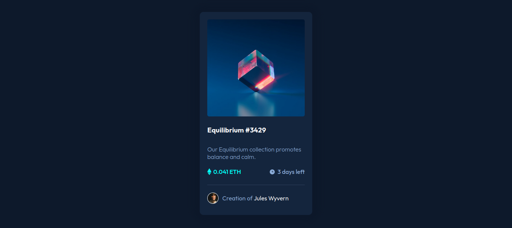

# Frontend Mentor - NFT preview card component solution

This is a solution to the [NFT preview card component challenge on Frontend Mentor](https://www.frontendmentor.io/challenges/nft-preview-card-component-SbdUL_w0U). Frontend Mentor challenges help you improve your coding skills by building realistic projects. 

## Table of contents

- [Overview](#overview)
  - [The challenge](#the-challenge)
  - [Screenshot](#screenshot)
- [My process](#my-process)
  - [Built with](#built-with)
  - [Continued development](#continued-development)

**Note: Delete this note and update the table of contents based on what sections you keep.**

## Overview

### The challenge

This challenge was very easy. This challenge is just a card-component center with flex and well layout with HTML. But there is a problem with my solution And I didn't know how to place the view image in the nft image, I try to search an Internet but I didn't find anything about it.

### Screenshot

## My process

First I layout my HMTL, after that I write my css code.

### Built with

- Semantic HTML5 markup
- CSS custom properties
- Flexbox
- CSS Grid

### Continued development

I will continue to development my knowledge of flexbox and responsive design.

